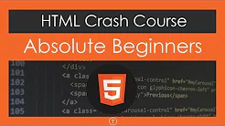

# HTML

 &nbsp; &nbsp;  &nbsp; &nbsp;  &nbsp; &nbsp; 

***

## Completed Courses:

|  | Courses | Certificate |
|:---:|:---:|:---:|
|  | [HTML5 e CSS3 parte 1: A primeira página da Web](https://cursos.alura.com.br/course/html5-css3-primeiros-passos) | [Certificate](https://cursos.alura.com.br/certificate/a0f3fac6-2fa9-4cb8-af6c-34cce123048f)  |

***

## Others videos watched:

 

***