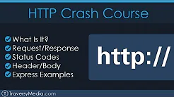

# HTTP

## Completed Courses:

| Courses | Certificate |
|:---:|:---:|
| [HTTP: Entendendo a web por baixo dos panos](https://cursos.alura.com.br/course/http-fundamentos) | [Certificate](https://cursos.alura.com.br/certificate/0f452ca5-fc30-41aa-9c7f-8067a3b14c4c)  |

***

## Others videos watched:

 

***

## HTTP request methods

Here are the main methods used: 

`GET`

The GET method requests a representation of the specified resource. Requests using GET should only retrieve data.

`POST`

The POST method is used to submit an entity to the specified resource, often causing a change in state or side effects on the server.

`PUT`

The PUT method replaces all current representations of the target resource with the request payload.

`DELETE`

The DELETE method deletes the specified resource.

***